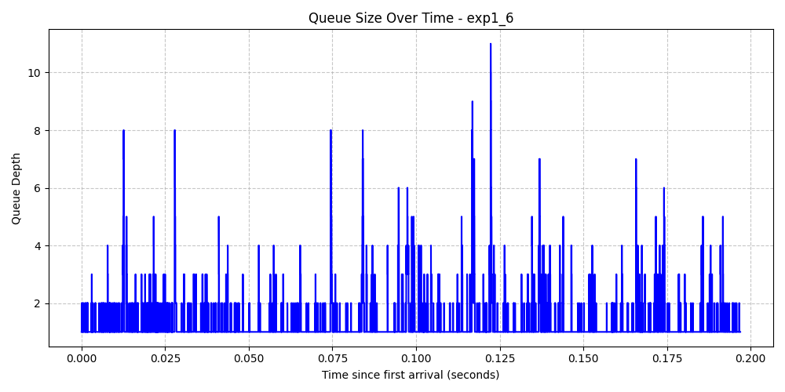
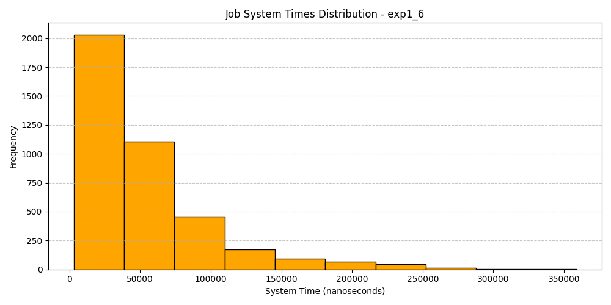
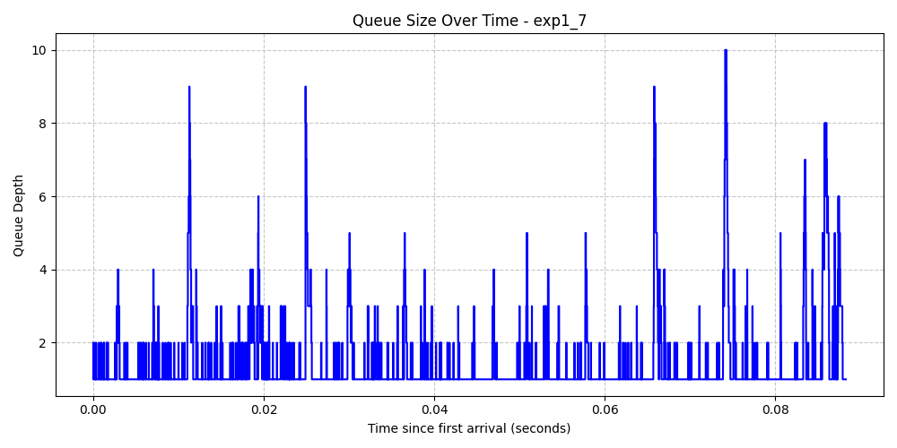
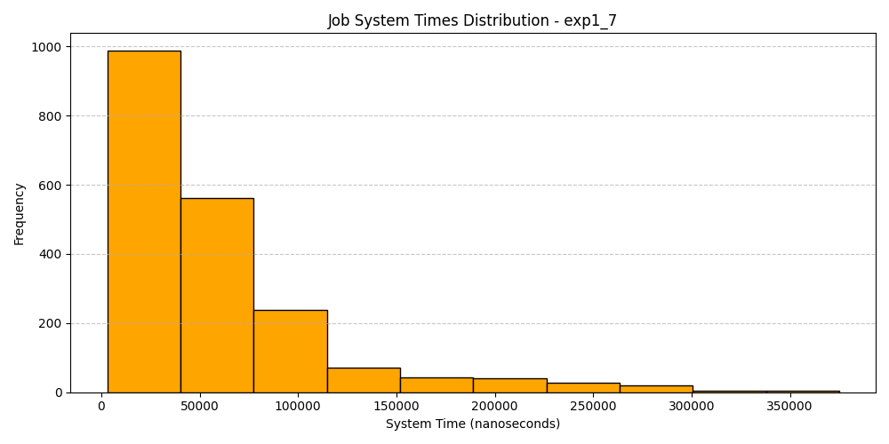
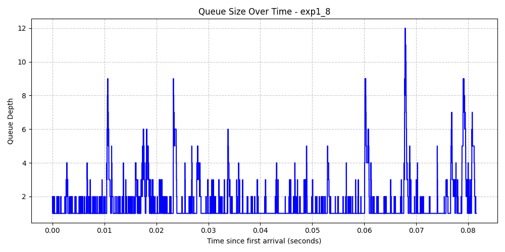
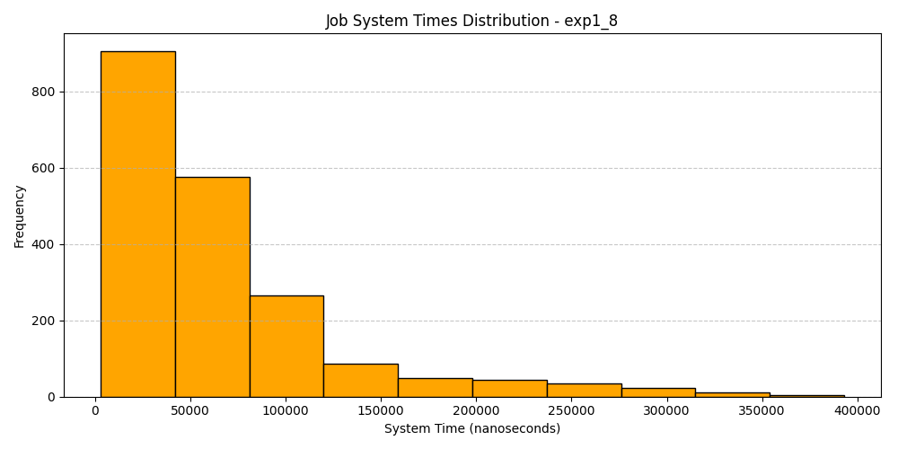
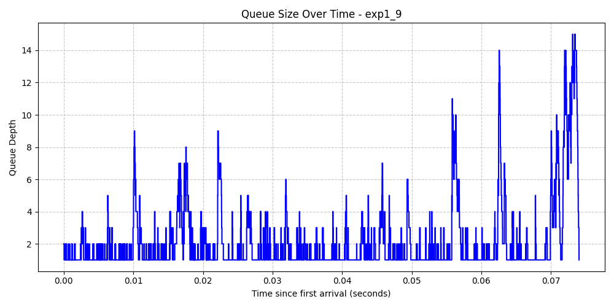
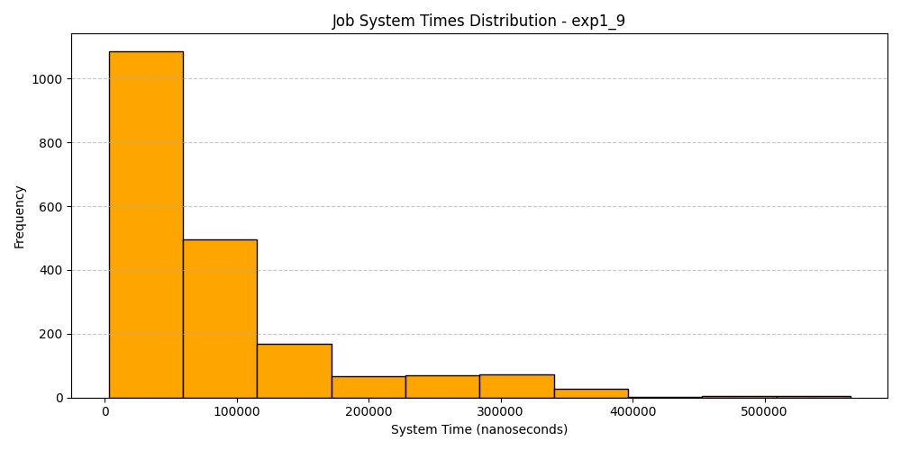

# Programming Assignment 1: Introduction to Computer Networks 512.4662

**Students:**

* Roy Sarafov, 209619477, <roysarafov@mail.tau.ac.il>
* Yoav Dychtwald, 209518299, <yoavhaid@mail.tau.ac.il>

## LLM Attribution

Parts of this code were developed with the assistance of an LLM (Kiro/Claude). All generated code was reviewed, tested, and understood by the authors.

## Submission Contents

* `server.c`: Implementation of the dual-thread UDP server using POSIX threads and `sys/queue.h` for dropping-tail queue management.
* `client.c`: Implementation of the UDP client that generates job demands via Poisson process distributions.
* `Makefile`: Compilation script configured with strict safety and sanitization flags.
* `README.pdf`: This document containing experiment statistics, graphics, and system analysis.

## Experiment Results

### 1. Single Client, Unbounded Queue

(Queue size set to >4000 to guarantee unbounded behavior)

#### Parameters: (μ=5, λ=3, Jobs=1000)

* **Average Job Time:** 505902.00 ns
* **Median Job Time:** 352000.00 ns
* **Average Queue Occupancy:** 1.53
* **Median Queue Occupancy:** 1.00

#### Parameters: (μ=3, λ=5, Jobs=1000)

* **Average Job Time:** 63550044.00 ns
* **Median Job Time:** 68117500.00 ns
* **Average Queue Occupancy:** 157.56
* **Median Queue Occupancy:** 176.00

#### Parameters: (μ=50, λ=30, Jobs=1000)

* **Average Job Time:** 49264.00 ns
* **Median Job Time:** 36000.00 ns
* **Average Queue Occupancy:** 1.40
* **Median Queue Occupancy:** 1.00

#### Parameters: (μ=5, λ=3, Jobs=4000)

* **Average Job Time:** 544094.75 ns
* **Median Job Time:** 384000.00 ns
* **Average Queue Occupancy:** 1.67
* **Median Queue Occupancy:** 1.00

#### Parameters: (μ=3, λ=5, Jobs=4000)

* **Average Job Time:** 266744677.25 ns
* **Median Job Time:** 255642000.00 ns
* **Average Queue Occupancy:** 651.09
* **Median Queue Occupancy:** 637.00

#### Parameters: (μ=50, λ=30, Jobs=4000)

* **Average Job Time:** 52041.50 ns
* **Median Job Time:** 38000.00 ns
* **Average Queue Occupancy:** 1.46
* **Median Queue Occupancy:** 1.00

#### Parameters: (μ=50, λ=35, Jobs=2000)

* **Average Job Time:** 57291.00 ns
* **Median Job Time:** 41000.00 ns
* **Average Queue Occupancy:** 1.63
* **Median Queue Occupancy:** 1.00

#### Parameters: (μ=50, λ=40, Jobs=2000)

* **Average Job Time:** 65153.00 ns
* **Median Job Time:** 47000.00 ns
* **Average Queue Occupancy:** 1.81
* **Median Queue Occupancy:** 1.00

#### Parameters: (μ=50, λ=45, Jobs=2000)

* **Average Job Time:** 83275.50 ns
* **Median Job Time:** 55000.00 ns
* **Average Queue Occupancy:** 2.45
* **Median Queue Occupancy:** 1.00

### 2. Two Clients, Unbounded Queue

(2000 jobs each, μ=50, λ=20)

* **Average Job Time:** 84508.75 ns
* **Median Job Time:** 62000.00 ns
* **Average Queue Occupancy:** 2.57
* **Median Queue Occupancy:** 2.00

### 3. Single Client, Bounded Queue (Size = 10)

(2000 jobs, checking dropping behavior)

#### Parameters: (μ=50, λ=45)

* **Total Jobs Dropped:** 15
* **Percentage Dropped:** 0.75%
* **Average Job Time:** 80804.53 ns

#### Parameters: (μ=50, λ=48)

* **Total Jobs Dropped:** 28
* **Percentage Dropped:** 1.40%
* **Average Job Time:** 88773.83 ns

---

## Visualizations

### 1. Single Client, Unbounded Queue (μ=5, λ=3, Jobs=1000)

#### 1. Queue Size Over Time

#### 1. Job System Times Histogram

### 2. Single Client, Unstable Unbounded Queue (μ=3, λ=5, Jobs=1000)

#### 2. Queue Size Over Time

#### 2. Job System Times Histogram

### 3. Single Client, Unbounded Queue (μ=50, λ=30, Jobs=1000)

#### 3. Queue Size Over Time

#### 3. Job System Times Histogram

### 4. Single Client, Unbounded Queue (μ=5, λ=3, Jobs=4000)

#### 4. Queue Size Over Time

#### 4. Job System Times Histogram

### 5. Single Client, Unstable Unbounded Queue (μ=3, λ=5, Jobs=4000)

#### 5. Queue Size Over Time

#### 5. Job System Times Histogram

### 6. Single Client, Unbounded Queue (μ=50, λ=30, Jobs=4000)

#### 6. Queue Size Over Time

#### 6. Job System Times Histogram

### 7. Single Client, Unbounded Queue (μ=50, λ=35, Jobs=2000)

#### 7. Queue Size Over Time

#### 7. Job System Times Histogram

### 8. Single Client, Unbounded Queue (μ=50, λ=40, Jobs=2000)

#### 8. Queue Size Over Time

#### 8. Job System Times Histogram

### 9. Single Client, Unbounded Queue (μ=50, λ=45, Jobs=2000)

#### 9. Queue Size Over Time

#### 9. Job System Times Histogram

### 10. Two Clients, Unbounded Queue (μ=50, λ=20, Jobs=4000 total)

#### 10. Queue Size Over Time

#### 10. Job System Times Histogram

### 11. Single Client, Bounded Queue (Size=10, μ=50, λ=45, Jobs=2000)

#### 11. Queue Size Over Time

#### 11. Job System Times Histogram

### 12. Single Client, Bounded Queue (Size=10, μ=50, λ=48, Jobs=2000)

#### 12. Queue Size Over Time

#### 12. Job System Times Histogram

