# Programming Assignment 1: Introduction to Computer Networks 512.4662

**Students:**
*   Roy Sarafov, 209619477, roysarafov@mail.tau.ac.il
*   Yoav Dychtwald, 209518299, yoavhaid@mail.tau.ac.il

## Submission Contents
*   `server.c`: Implementation of the dual-thread UDP server using POSIX threads and `sys/queue.h` for dropping-tail queue management.
*   `client.c`: Implementation of the UDP client that generates job demands via Poisson process distributions.
*   `Makefile`: Compilation script configured with strict safety and sanitization flags.
*   `README.pdf`: This document containing experiment statistics, graphics, and system analysis.

## Experiment Results

### 1. Single Client, Unbounded Queue
*(Queue size set to >4000 to guarantee unbounded behavior)*

**Parameters: (μ=5, λ=3)**
*   **Average Job Time:** 1512357.18 ns
*   **Median Job Time:** 1125332.00 ns
*   **Average Queue Occupancy:** 1.49
*   **Median Queue Occupancy:** 1.00

**Parameters: (μ=3, λ=5)**
*   **Average Job Time:** 40882358.41 ns
*   **Median Job Time:** 40798901.00 ns
*   **Average Queue Occupancy:** 39.99
*   **Median Queue Occupancy:** 32.00

*(Additional results for 2000 and 4000 jobs)*

**Parameters: (μ=50, λ=30, Jobs=2000)**
*   **Average Job Time:** 509057.29 ns
*   **Median Job Time:** 298221.50 ns
*   **Average Queue Occupancy:** 1.60
*   **Median Queue Occupancy:** 1.00

**Parameters: (μ=50, λ=35, Jobs=2000)**
*   **Average Job Time:** 939607.13 ns
*   **Median Job Time:** 408977.50 ns
*   **Average Queue Occupancy:** 3.47
*   **Median Queue Occupancy:** 1.00

**Parameters: (μ=50, λ=30, Jobs=4000)**
*   **Average Job Time:** 2030482.60 ns
*   **Median Job Time:** 379830.50 ns
*   **Average Queue Occupancy:** 5.52
*   **Median Queue Occupancy:** 1.00

### 2. Two Clients, Unbounded Queue
*(2000 jobs each, μ=50, λ=20)*

*   **Average Job Time:** 314285700.69 ns
*   **Median Job Time:** 115984159.00 ns
*   **Average Queue Occupancy:** 578.21
*   **Median Queue Occupancy:** 565.00

### 3. Single Client, Bounded Queue (Size = 10)
*(2000 jobs, checking dropping behavior)*

**Parameters: (μ=50, λ=45)**
*   **Total Jobs Dropped:** 0
*   **Percentage Dropped:** 0.00%
*   **Average Job Time:** 668620.05 ns

**Parameters: (μ=50, λ=48)**
*   **Total Jobs Dropped:** 0
*   **Percentage Dropped:** 0.00%
*   **Average Job Time:** 370441.27 ns

---

## Visualizations

### 1. Single Client, Unbounded Queue (μ=5, λ=3, Jobs=1000)
#### Queue Size Over Time
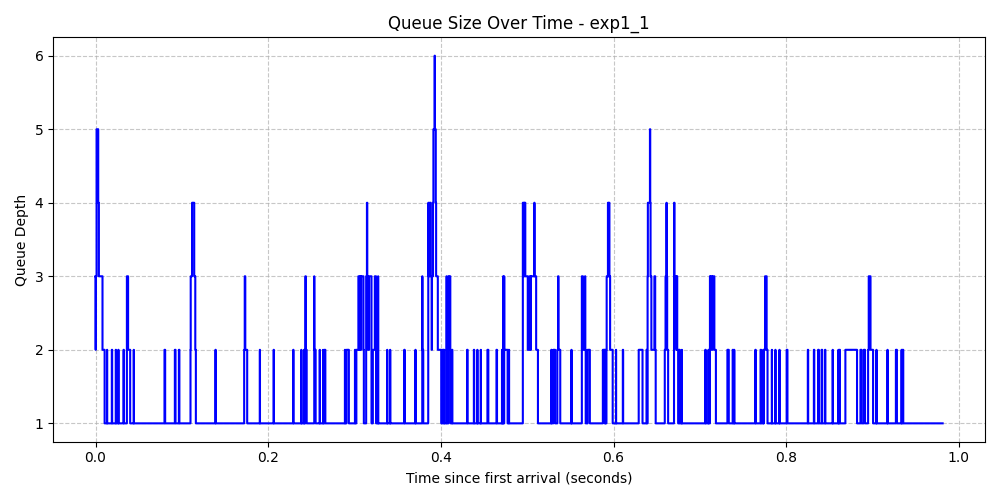

#### Job System Times Histogram
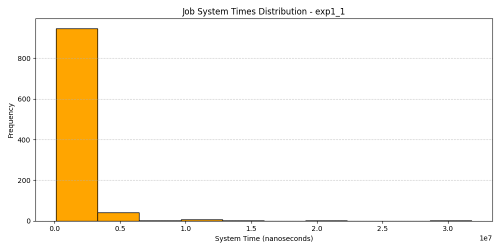

### 2. Single Client, Unstable Unbounded Queue (μ=3, λ=5, Jobs=1000)
#### Queue Size Over Time
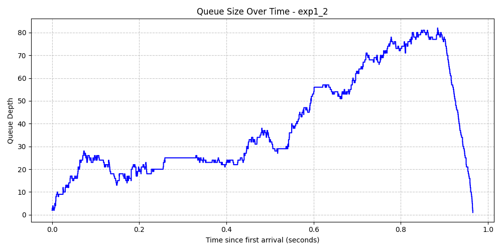

#### Job System Times Histogram
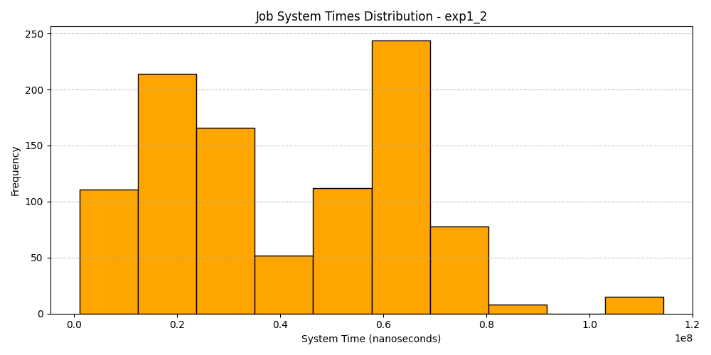

### 3. Single Client, Unbounded Queue (μ=50, λ=30, Jobs=2000)
#### Queue Size Over Time
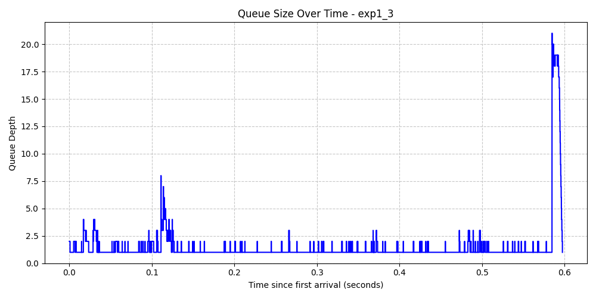

#### Job System Times Histogram
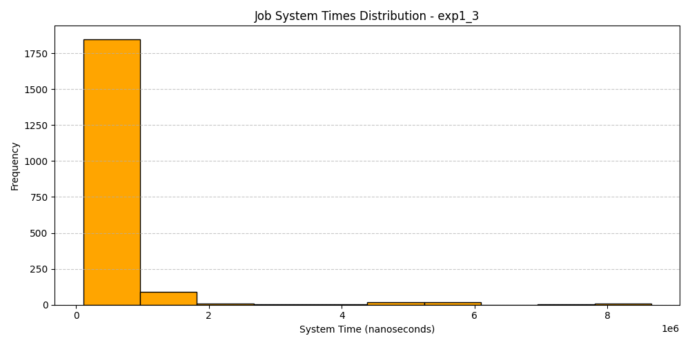

### 4. Single Client, Unbounded Queue (μ=50, λ=35, Jobs=2000)
#### Queue Size Over Time
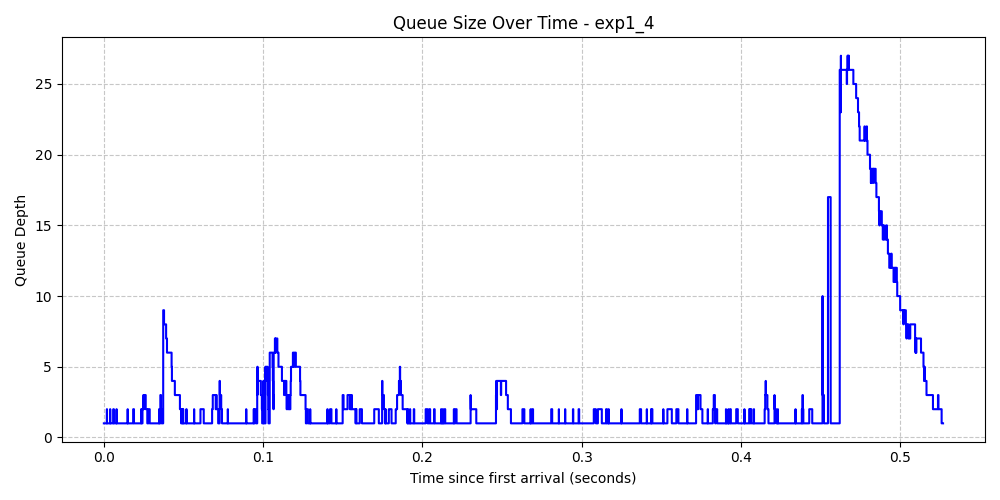

#### Job System Times Histogram
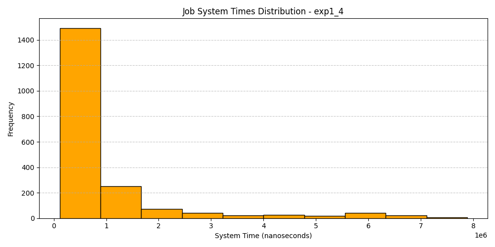

### 5. Single Client, Unbounded Queue (μ=50, λ=30, Jobs=4000)
#### Queue Size Over Time
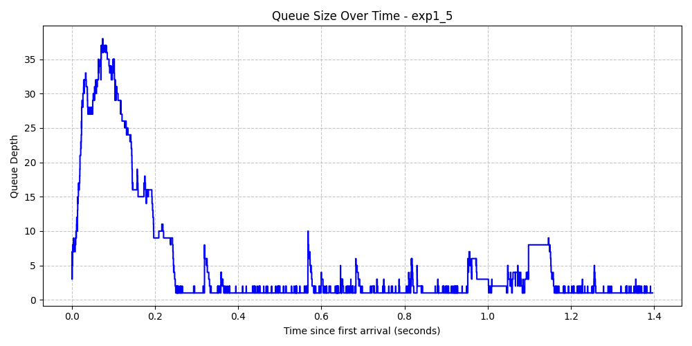

#### Job System Times Histogram
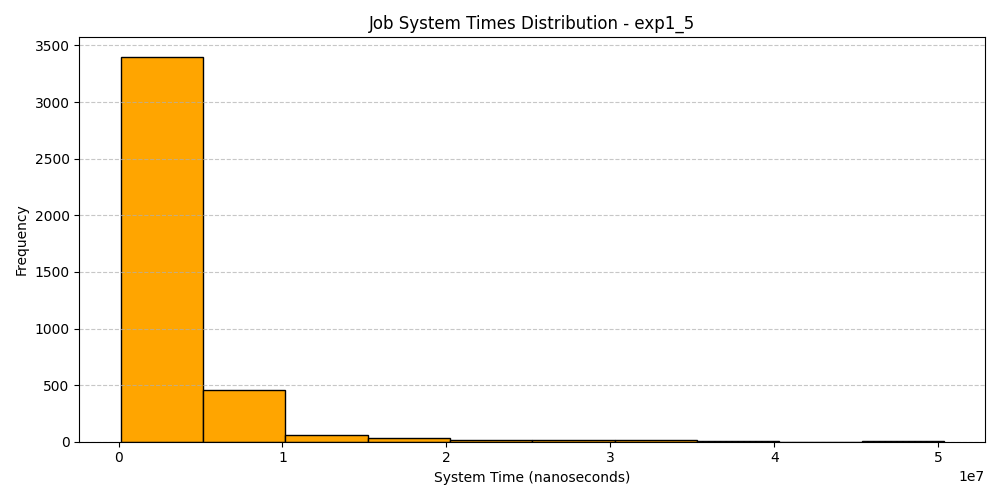

### 6. Two Clients, Unbounded Queue (μ=50, λ=20, Jobs=4000 total)
#### Queue Size Over Time
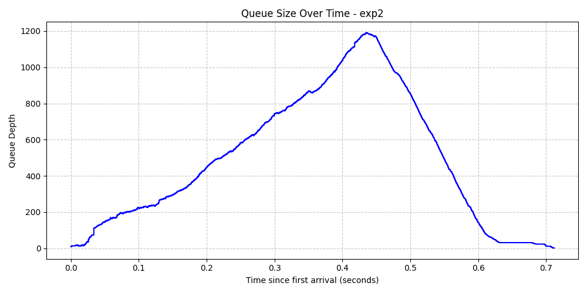

#### Job System Times Histogram
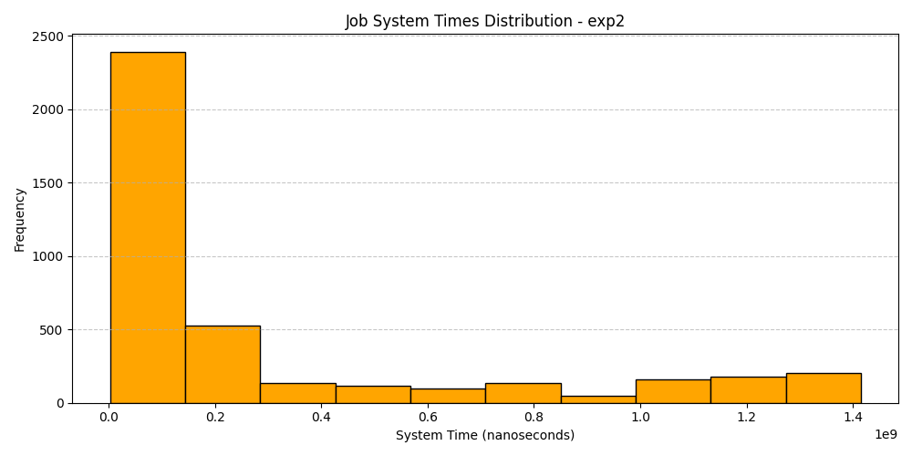

### 7. Single Client, Bounded Queue (Size=10, μ=50, λ=45, Jobs=2000)
#### Queue Size Over Time
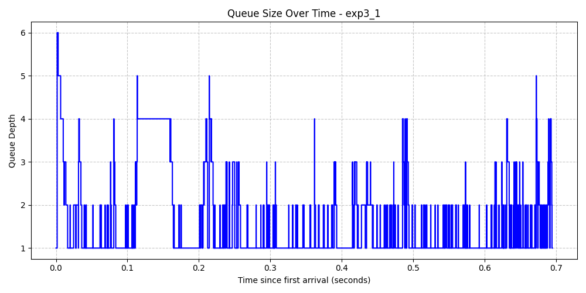

#### Job System Times Histogram
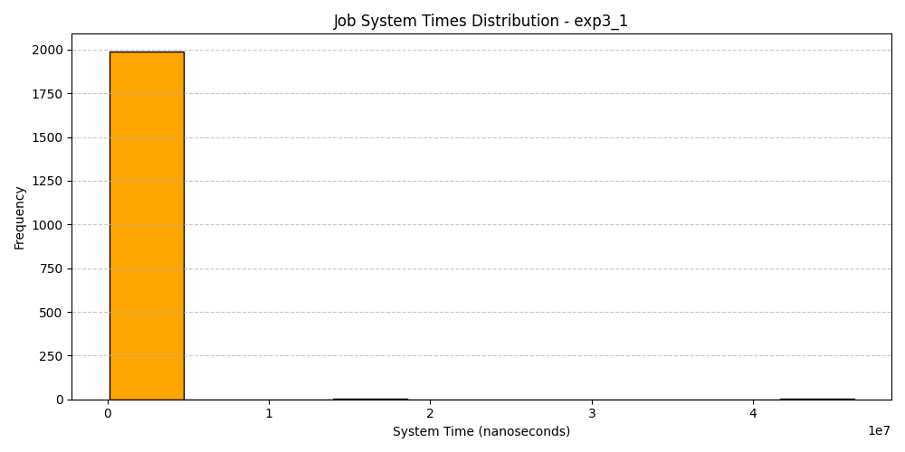

### 8. Single Client, Bounded Queue (Size=10, μ=50, λ=48, Jobs=2000)
#### Queue Size Over Time
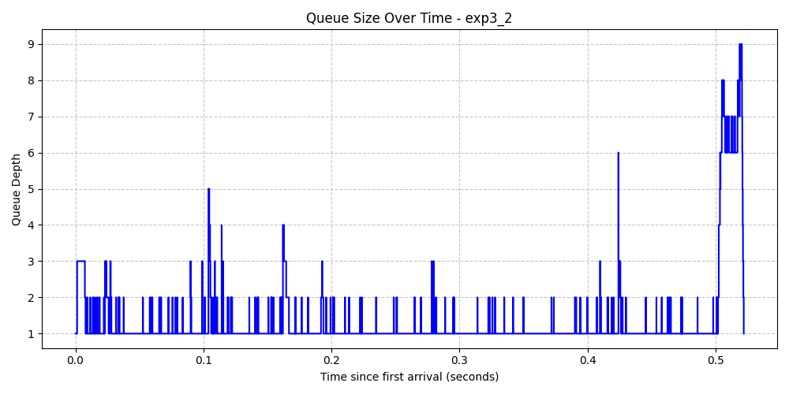

#### Job System Times Histogram
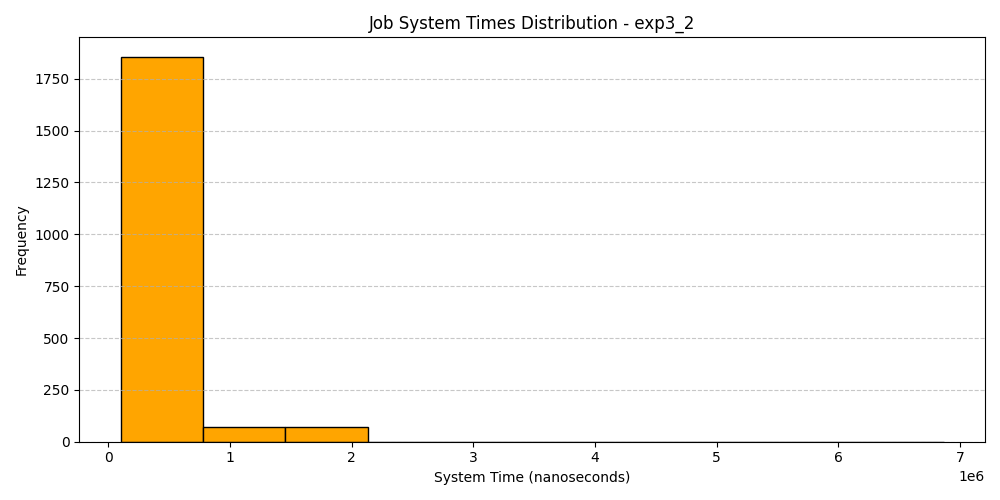
